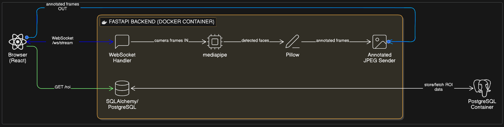

# Real-Time Face Detection Video Streaming System

A containerised full-stack application that accepts a live video feed, detects faces using MediaPipe, draws bounding boxes using Pillow (no OpenCV), stores ROI data in PostgreSQL, and streams annotated frames back to a React frontend.

---

## Architecture



---

## Tech Stack

| Layer | Technology |
|---|---|
| Backend API | FastAPI + WebSockets |
| Face Detection | MediaPipe (no OpenCV) |
| ROI Drawing | Pillow |
| Database | PostgreSQL + SQLAlchemy + Alembic |
| Frontend | React.js |
| Containerisation | Docker + Docker Compose |

---

## API Endpoints

| Method | Path | Description |
|---|---|---|
| `WS` | `/ws/stream` | Send raw frames, receive annotated frames |
| `GET` | `/roi` | Fetch all ROI records for a session |
| `GET` | `/roi/latest` | Fetch most recent ROI record |
| `GET` | `/health` | Health check |

---

## Run in 5 Minutes

### Prerequisites
- [Docker Desktop](https://www.docker.com/products/docker-desktop) installed and running
- That's it!

### Steps

```bash
# 1. Clone the repo
git clone https://github.com/daksharyan18aug/Real-Time-Face-Detection-Video-Streaming-System.git
cd Real-Time-Face-Detection-Video-Streaming-System

# 2. Copy environment file
cp .env.example .env

# 3. Build and start everything
docker compose up --build
```

Then open your browser:

| Service | URL |
|---|---|
| Frontend | http://localhost:3000 |
| Backend API docs | http://localhost:8000/docs |
| Health check | http://localhost:8000/health |

### To Stop
```bash
docker compose down
```

### To Stop and Remove Database
```bash
docker compose down -v
```

---

## How It Works

1. React frontend accesses your webcam via `getUserMedia()`
2. Frames are captured from a canvas and sent as JPEG bytes over WebSocket to `/ws/stream`
3. FastAPI receives each frame and runs MediaPipe face detection
4. If a face is found, Pillow draws a green axis-aligned bounding box (ROI)
5. ROI coordinates are stored in PostgreSQL with a session ID
6. The annotated frame is sent back over WebSocket and displayed in the browser
7. The ROI data table polls `GET /roi` every 2 seconds to show detection history

---

## Project Structure
├── architecture.png          # System architecture diagram
├── docker-compose.yml        # All services wired together
├── .env.example              # Environment variable template
├── backend/
│   ├── app/
│   │   ├── main.py           # FastAPI endpoints
│   │   ├── detector.py       # MediaPipe face detection
│   │   ├── drawer.py         # Pillow ROI drawing
│   │   ├── models.py         # SQLAlchemy DB models
│   │   ├── schemas.py        # Pydantic schemas
│   │   ├── database.py       # DB connection
│   │   └── crud.py           # DB operations
│   ├── tests/                # pytest test suite
│   ├── alembic/              # DB migrations
│   └── Dockerfile
└── frontend/
├── src/
│   ├── App.jsx
│   └── components/
│       ├── VideoStream.jsx
│       └── ROITable.jsx
└── Dockerfile

---

## Running Tests

```bash
cd backend
pip install -r requirements.txt
$env:PYTHONPATH = "."        # Windows
python -m pytest tests/ -v
```

---

## AI Tool Usage

This project was built with guidance from Claude (Anthropic) as an AI assistant.
AI was used for:
- Suggesting project structure and architecture
- Helping debug Windows-specific issues (PowerShell vs bash)
- Explaining MediaPipe Tasks API changes

All code was reviewed, understood, and adapted manually.

---

## Security Notes

- Backend runs as non-root user inside Docker
- Secrets are managed via environment variables, never hardcoded
- CORS is configured for local development